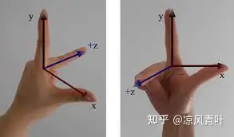

# 变换

## 基本变换

### 线性变换

#### 放缩

$$
scale =
\begin{bmatrix}
	x_s & 0\\
	0 & x_y
\end{bmatrix}
$$

#### 错切

$$
shearX =
\begin{bmatrix}
	1 & x_s\\
	0 & 1
\end{bmatrix}
$$

$$
shearY =
\begin{bmatrix}
	1 & 0\\
	y_s & 1
\end{bmatrix}
$$

#### 旋转

$$
rotate =
\begin{bmatrix}
	\cos\phi & -sin\phi\\
	\sin\phi & \cos\phi
\end{bmatrix}
$$

#### 反射

$$
reflecX =
\begin{bmatrix}
	1 & 0\\
	0 & -1
\end{bmatrix}
$$

$$
reflecY =
\begin{bmatrix}
	-1 & 0\\
	0 & 1
\end{bmatrix}
$$

### 非线性

#### 平移
增加维度，把平移变换写成齐次坐标

$$
translate =
\begin{bmatrix}
	1 & 0 & x_t\\
	0 & 1 & y_t \\
	0 & 0 & 1
\end{bmatrix}
$$

## 3D 变换

### 视角变换

视图变换矩阵就是将世界坐标系转换到摄像机坐标系的矩阵，将世界坐标系转换到相机的坐标系可能比较麻烦.

但是我们可以反过来，先求出摄像机坐标系转换到世界坐标系的变换矩阵，然后求逆就可以得到视图变换矩阵。因此我们先将原来摄像机的坐标原点变换到世界坐标原点，并看向-z轴，然后将剩下的坐标轴旋转为世界坐标系新的三个坐标轴，也就是先做平移变换，再做旋转变换
$$
Camera = T \cdot R
$$

$$
Camera^{-1} = View = (R\cdot T)^{-1}
$$

R是正交阵，逆等价于转置

### 正交投影

将视图空间（eye space）的坐标线性的映射到NDC（normalized device coordinates）坐标中